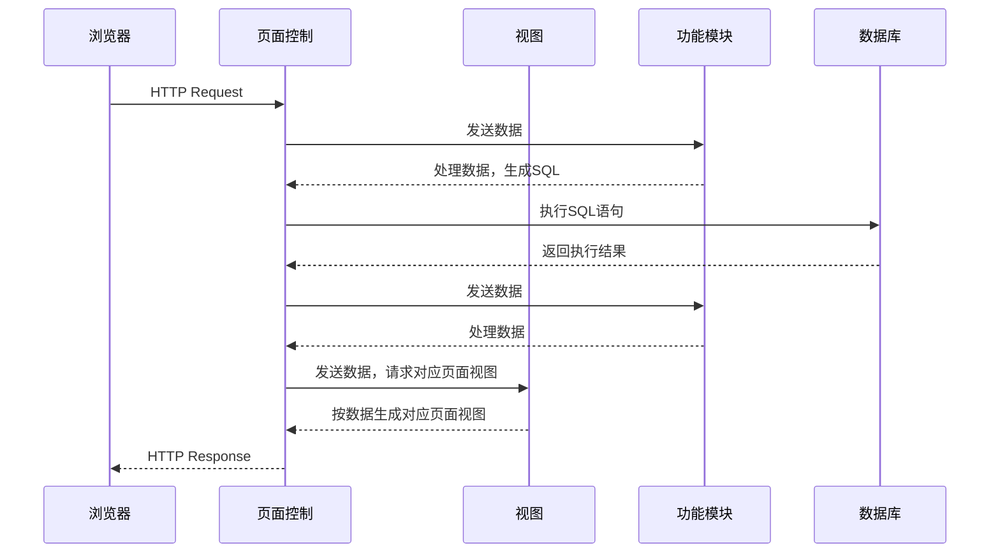

```mermaid
sequenceDiagram
    participant a as 浏览器
    participant b as 页面控制
    participant c as 视图
    participant d as 功能模块
    participant e as 数据库
    a ->> b: HTTP Request
    b ->> d: 发送数据
    d -->> b: 处理数据，生成SQL
    b ->> e: 执行SQL语句
    e -->> b: 返回执行结果
    b ->> d: 发送数据
    d -->> b: 处理数据
    b ->> c: 发送数据，请求对应页面视图
    c -->> b: 按数据生成对应页面视图
    b -->> a: HTTP Response
    

```

