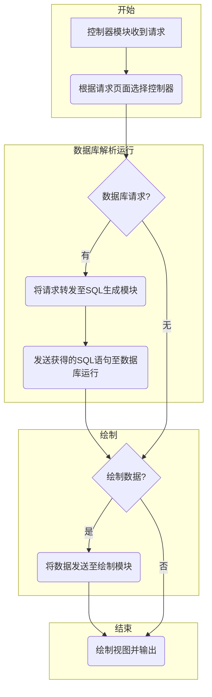

```mermaid
graph TB
	subgraph 开始
		v1[控制器模块收到请求] --> v3(根据请求页面选择控制器)
	end
	subgraph 数据库解析运行
		v3 --> v4
		v4{数据库请求?} --有--> v5(将请求转发至SQL生成模块)
		v5 --> v6(发送获得的SQL语句至数据库运行)
		
	end
	subgraph 绘制
		v6 --> v7
		v4 --无--> v7{绘制数据?}
		v7 --是--> v8(将数据发送至绘制模块)
	end
	subgraph 结束
		v8 --> v9(绘制视图并输出)
		v7 --否--> v9
	end
	
```

