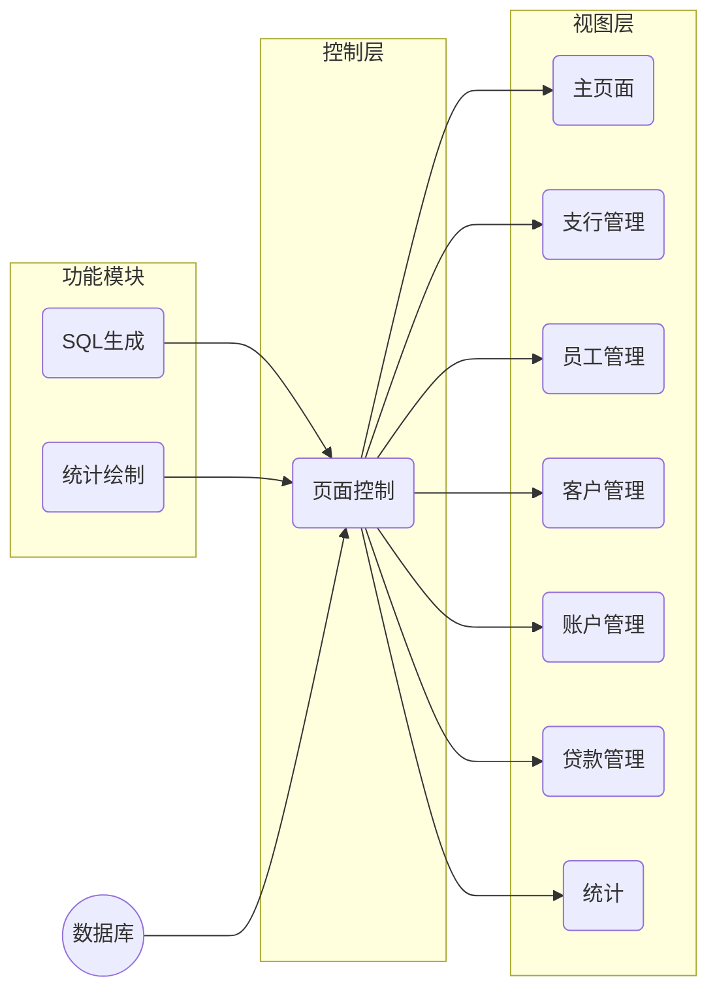

```mermaid
graph LR;
	subgraph 视图层
		v1(主页面)
		v2(支行管理)
		v3(员工管理)
		v4(客户管理)
		v5(账户管理)
		v6(贷款管理)
		v7(统计)
	end
	subgraph 控制层
		c1(页面控制) --> v1
		c1(页面控制) --> v2
		c1(页面控制) --> v3
		c1(页面控制) --> v4
		c1(页面控制) --> v5
		c1(页面控制) --> v6
		c1(页面控制) --> v7
	end
	subgraph 功能模块
		m1(SQL生成) --> c1
		m2(统计绘制) --> c1
	end
	d1((数据库)) --> c1
```

